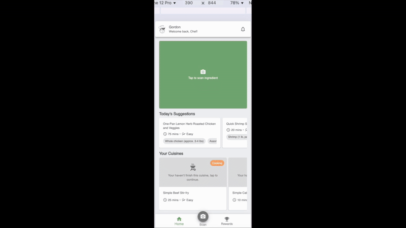

## ECOBITES

</img>

## Introduction

Users can use our web platform to solve the problem of not knowing how to handle ingredients or leftovers in their fridge.

Through our platform, they can take a photo of the ingredients in their fridge and receive recipe suggestions powered by AI. After selecting a favorite recipe and cooking the dish, they can upload a post with a photo of their creation to earn reward ingredient cards.

By collecting enough ingredient cards, users can create and collect adorable recipe cards.

## [Frontend Repo](https://github.com/vivi2393142/ecoBites-web)

## Backend Info

## Tech stack

Backend: Express js
Google Cloud Service:

- GCS: Store img on cloud
- Google build: Delpoy server to cloud
- Google run: Delpoy server to cloud
- Ai chat - Gemini API: Generate recipes suggestion
- Firestore: NoSQL database
  

## Database - Firestore

## Dependencies

- @google-cloud/firestore
- @google-cloud/storage
- @google-cloud/vertexai
- cors: Allow frontend to call server APIs.
- module-alias: Format developing path
- multer: Handle receiving image/file
- nodemon: auto reload when updating code in local developing.

## AI helper

- ChatGPT: ask coding questions, generate cards images
- Gemini: generate recipes suggestion for app

## Future Optimize

- Cloud run reject receiving Gemini image upload API
- Remove key.json in project, using Secret Manager for key management
